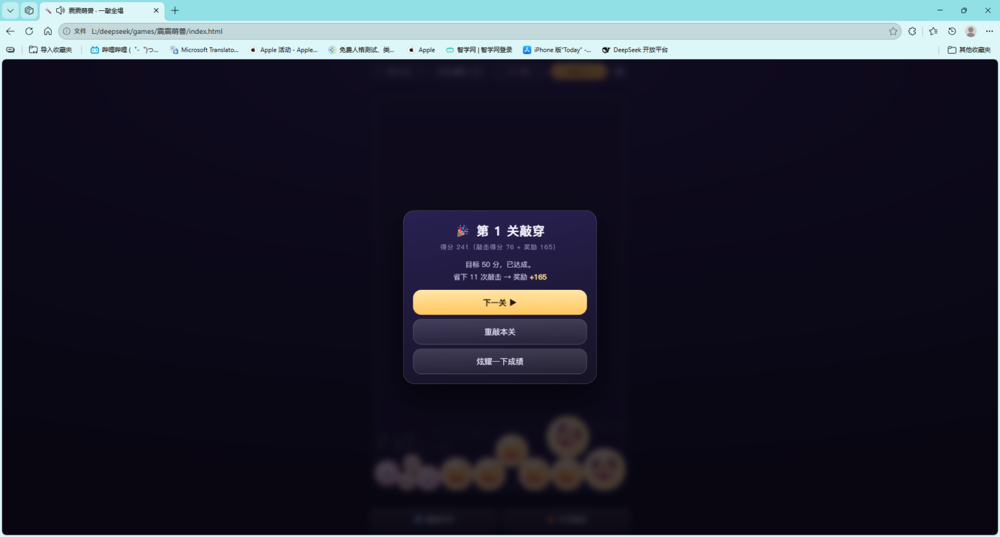
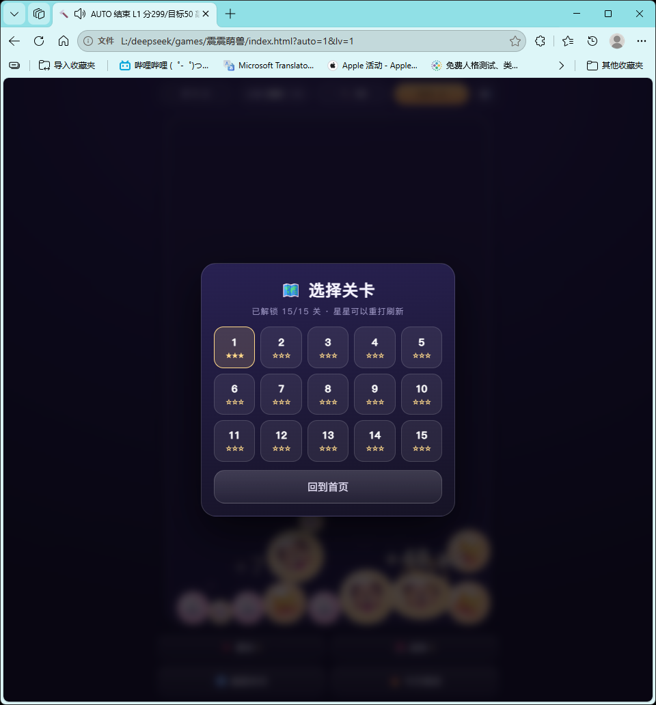
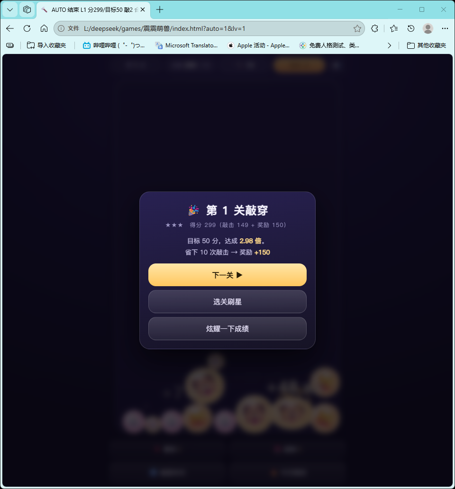

# 🔨 震震萌兽 · Shake Shake Beasts

> **一敲全塌。** 敲一下，冲击波从落点扩散开，整堆萌兽被掀起来乱撞——**撞得够狠**的同款才会合体，连锁自己会滚起来。
>
> A one-verb physics puzzle: **smash the pile, let the shockwave chain-merge it.** No install, no assets, one HTML file.

🎮 **在线试玩 → <https://xcxi.github.io/shake-shake-beasts/>** （手机浏览器也能玩）



## 玩法

开局桌上已经堆好一堆萌兽，你**只有有限次敲击**。

| 操作 | 手机 | 电脑 |
| --- | --- | --- |
| 移动落点 | 拖动 | 移动鼠标 / `←→↑↓` |
| 敲一下 | 松手 | 点击 / `空格` |
| 💥 重锤 | 点按钮 | `1` 或点按钮 |
| 🧲 磁锤 | 点按钮 | `2` 或点按钮 |
| 重开本关 | 底部按钮 | `R` |

规则只有四条：

1. 敲击点会扩散出一圈**行进的**冲击波，波前扫到谁才掀谁（不是瞬间全场生效）
2. 被掀起来的萌兽乱撞，**撞击力度够大**的同款才会合体（静止靠着不算）
3. 分数到本关目标就算过关，**省下的敲击次数每次换 15 分**
4. 敲击次数用完还没到目标 → 失败，重敲

### 两种特殊锤（每关各 1 次，不占普通敲击次数）

| 锤 | 效果 | 实测一次引发的合成数 |
| --- | --- | --- |
| 💥 **重锤** | 冲击波范围 ×1.5、威力 ×1.6，橙色粗环 | **12.0** |
| 🧲 **磁锤** | 把周围萌兽**朝落点吸成一团**，并且 1.1 秒内**轻碰也能合体** | **17.2** |
| 🔨 普通敲 | —— | 8.8 |

> 数据来自 `tools/_tools_test.cjs`：15 关取样、每种锤 3 个随机种子，统计"一次锤在 1.5 秒内引发的合成次数"。两种特殊锤都明显强于普通敲 —— 它们是**留给卡关时的爆发**，而不是可有可无的装饰。

### 其它玩法层

- ⭐ **星级评价**：达标 1 星、1.6 倍目标 2 星、2.4 倍目标 3 星（星级只看敲出来的分，不算剩余次数奖励）
- 🗺️ **选关刷星**：15 关全解锁后可以回头重打刷新星级，存本机
- 📖 **萌兽图鉴**：10 种萌兽，合出来过就永久点亮；🐲 龙王要靠后面的大堆才出得来
- 🔥 **今日挑战**：按日期固定生成同一局面，全世界同一天同一局




共 **15 关**：前 4 关 18 只萌兽，中间 24 只，最后 30 只；敲击次数从 12 次递减到 7 次。还有 🔥 **今日挑战**（按日期固定生成同一局面）。

## 它和"消消乐 / 合成大西瓜"不是一回事

| | 常见做法 | 这里 |
| --- | --- | --- |
| 动词 | 选中消除 / 投掷 | **敲**：施加一次会扩散的冲击 |
| 合成条件 | 碰到就合 | **要有撞击力度**才合 |
| 失败条件 | 卡槽满 / 顶到线 | **敲击次数用完还没到分** |
| 局面 | 你一张张往上放 | 局面一开始就在，你只能**破坏**它 |

**你不是在摆放，你是在拆。**

## 关卡难度是"量"出来的，不是拍脑袋写的

仓库里带了这个游戏的自检工具，它内置 **4 种"人可能这么打"的策略机器人**（同款最密处敲 / 堆底上掀 / 堆顶下压 / 随机乱敲），每种跑 3 个随机种子 × 15 关，最终目标分取**平均分的 50%**，且不超过**最差运气的 85%**：

```
$ node tools/_test.js
关卡 目标 敲击 | 同款中心  堆底中心  堆顶下压  随机乱敲   | 最快节奏 合成数 静置互穿
  1    50  12  | ✅50     ✅399    ✅128      36      |   93✅  合成 7  互穿0.07
  8   160  10  | ✅844    ✅529    ✅170    ✅205     |  165✅  合成 8  互穿0.07
 15   205   7  | ✅366     188     ✅208    ✅250     |  228✅  合成 6  互穿6.33
PHYS/INVARIANT ALL PASS
```

同一份代码还逐帧检查物理不变量：NaN、穿墙、穿地板、球数爆炸、静止时互相穿透。**认真打能过，乱敲会卡在某几关。**

```bash
node tools/_test.js              # 完整验收（物理不变量 + 4 策略 × 15 关平衡）
node tools/_tools_test.cjs       # 特殊锤验收（受控方向测试 + 一次锤的合成产出）
CALIB=2 node tools/_test.js      # 重新标定难度（多种子测"正常能打多少分"）
ONLY=15 node tools/_test.js      # 只测第 15 关
node tools/_diag.js              # 检查开局堆叠有没有把球埋在一起
```

## 技术

- **单文件零依赖**：`index.html` 一个文件，没有图片、没有音频文件、没有后端、不联网。萌兽是 emoji，音效用 WebAudio 实时合成。
- **自写圆形物理**：质量正确的冲量求解 + 每步 12 次迭代 + 位置去重叠，容器 400×620 里同时 30 只球稳得住。
- **移动端就绪**：自适应缩放、safe-area 刘海适配、禁双击缩放、系统分享（`navigator.share`）。
- **存档**：最高关卡与今日挑战成绩存 `localStorage`。

开发中修掉的真 bug（都留了注释）：

- 速度冲量按质量算错 → 大球飞得比小球还快
- 堆开局时上一只球没落下去，下一只从同一个出生点丢出 → 两只球互相埋进 62px
- 球堆太挤时冲击波推不动任何东西（敲了没反应）→ 改成"每种萌兽落在自己的竖带上，一敲带出一串"，运气方差也从 10 倍收敛到 2 倍以内
- 磁锤第一版"把所有球吸向落点"实测只值 3.2 次合成（普通敲 9.2）→ 等于死功能；改成"吸成一团 + 1.1 秒内降低合体门槛"后升到 17.2 次，才成为值得留着的爆发

## 本地运行

直接双击 `index.html` 就行。想用本地服务器：

```bash
python -m http.server 8000    # 然后打开 http://127.0.0.1:8000
```

## 已知小瑕疵

30 只球的最难关里，偶尔会有一只小球被卡在墙角和大球之间推不出来，看起来被压扁几个像素（实测最差 6.3px）。纯视觉，不影响玩法与可解性。

## License

[MIT](LICENSE) —— 随便玩、随便改、商用也行，保留版权声明即可。
